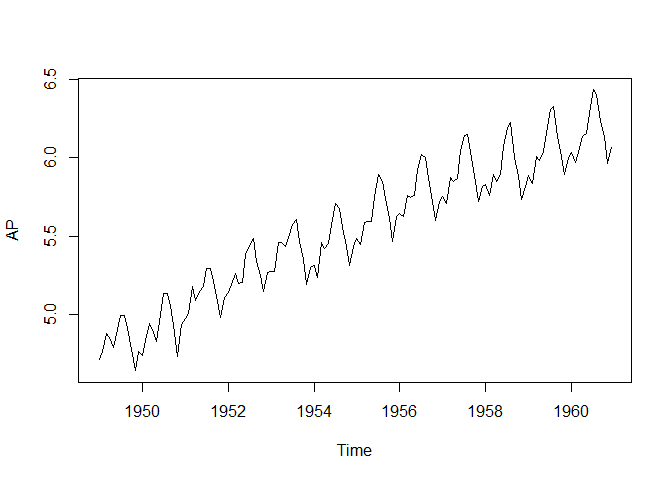
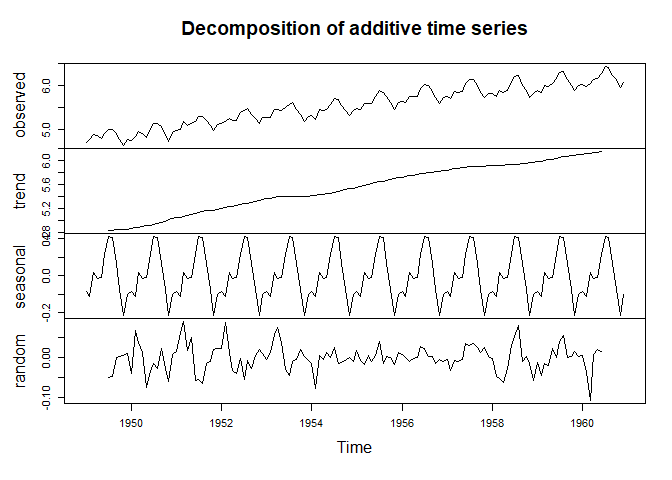
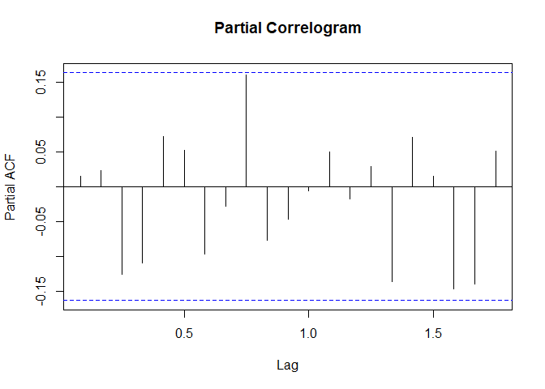

R Notebook
================

``` r
data("AirPassengers")
AP <- AirPassengers
str(AP) # Time series with 144 values from years 1949 to 1961
```

    ##  Time-Series [1:144] from 1949 to 1961: 112 118 132 129 121 135 148 148 136 119 ...

``` r
# number of passenger in each month in each year = 112 118 129 ...
```

``` r
ts(AP, frequency=12, start=c(1494,1)) # because we have monthly data from 1494 from January
```

    ##      Jan Feb Mar Apr May Jun Jul Aug Sep Oct Nov Dec
    ## 1494 112 118 132 129 121 135 148 148 136 119 104 118
    ## 1495 115 126 141 135 125 149 170 170 158 133 114 140
    ## 1496 145 150 178 163 172 178 199 199 184 162 146 166
    ## 1497 171 180 193 181 183 218 230 242 209 191 172 194
    ## 1498 196 196 236 235 229 243 264 272 237 211 180 201
    ## 1499 204 188 235 227 234 264 302 293 259 229 203 229
    ## 1500 242 233 267 269 270 315 364 347 312 274 237 278
    ## 1501 284 277 317 313 318 374 413 405 355 306 271 306
    ## 1502 315 301 356 348 355 422 465 467 404 347 305 336
    ## 1503 340 318 362 348 363 435 491 505 404 359 310 337
    ## 1504 360 342 406 396 420 472 548 559 463 407 362 405
    ## 1505 417 391 419 461 472 535 622 606 508 461 390 432

``` r
attributes(AP) # in a year we have 12 data points from year 1949 to 1960 something month
```

    ## $tsp
    ## [1] 1949.000 1960.917   12.000
    ## 
    ## $class
    ## [1] "ts"

<!-- -->

The number of passengers are gradually going up. But there is also some
amount of seasonality (there are periods of the year which are higher,
some other periods are lower). This time series is definitely not
stationary (THIS IS A PROBLEM)

## What can we do? Log transformation (to reduce fluctuations/std)

``` r
AP <- log(AP)
plot(AP)
```

<!-- -->

## Decomposition of additive time series

``` r
decomp <- decompose(AP)
decomp$figure
```

    ##  [1] -0.085815019 -0.114412848  0.018113355 -0.013045611 -0.008966106
    ##  [6]  0.115392997  0.210816435  0.204512399  0.064836351 -0.075271265
    ## [11] -0.215845612 -0.100315075

\-0.0858 for jan, -0.1144 for feb, etc.

``` r
plot(decomp$figure,
     type="b",
     xlab='Month',
     ylab="Seasonality Index",
     col="blue",
     las = 2) # make the numbers appear vertical
```

<!-- -->

Peaks at July. July has 20% more volume than average. November has 20%
less volume than average

``` r
plot(decomp)
```

<!-- -->

trend captures the mean, seasonality captures the fluctuations pattern,
random.

# 2nd video: ARIMA - Autoregressive Integrated Moving Average

## ACF & PACF Plots

## Ljung-Box Test

## Residual Plot

## Forecast

``` r
#install.packages("forecast")
library(forecast)
```

    ## Warning: package 'forecast' was built under R version 4.0.3

    ## Registered S3 method overwritten by 'quantmod':
    ##   method            from
    ##   as.zoo.data.frame zoo

``` r
# find BEST arima model based on AIC or BIC value
model <- auto.arima(AP)
model
```

    ## Series: AP 
    ## ARIMA(0,1,1)(0,1,1)[12] 
    ## 
    ## Coefficients:
    ##           ma1     sma1
    ##       -0.4018  -0.5569
    ## s.e.   0.0896   0.0731
    ## 
    ## sigma^2 estimated as 0.001371:  log likelihood=244.7
    ## AIC=-483.4   AICc=-483.21   BIC=-474.77

The data used was AP. p (AR order) = 0, d (degree of differencing) = 1,
q (Moving Average order) = 1

``` r
attributes(model)
```

    ## $names
    ##  [1] "coef"      "sigma2"    "var.coef"  "mask"      "loglik"    "aic"      
    ##  [7] "arma"      "residuals" "call"      "series"    "code"      "n.cond"   
    ## [13] "nobs"      "model"     "bic"       "aicc"      "x"         "fitted"   
    ## 
    ## $class
    ## [1] "forecast_ARIMA" "ARIMA"          "Arima"

``` r
model$coef
```

    ##        ma1       sma1 
    ## -0.4018280 -0.5569448

## ACF & PACF Plots

``` r
acf(model$residuals, main="Correlogram")
```

<!-- -->

The blue dotted lines are significant bounds. only lag 0 is outside the
significant bounds.

``` r
pacf(model$residuals, main="Partial Correlogram")
```

<!-- --> All lags
are within the significant bounds.

## What if some lags ACF values are in the verge of violating the bounds??

## Ljung-Box Test
